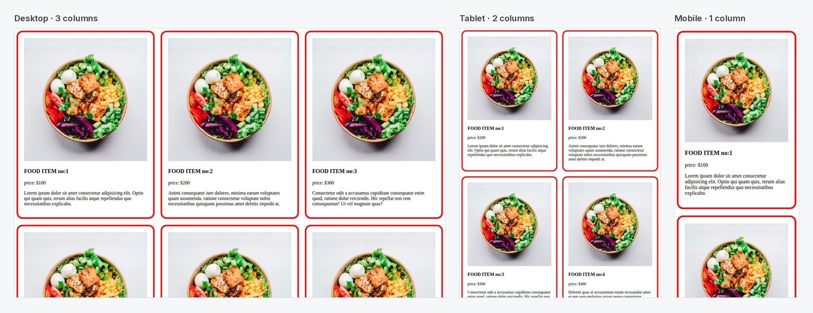

# Responsive Website Layout — CSS Grid & Media Queries

A responsive card grid for a food menu that reflows across screen sizes using **CSS Grid** and **media queries**, with no frameworks.

[](https://shayan-abrar.github.io/Responsive-Website-Layout/) <!-- live-demo -->




## How It Works

Twelve menu cards sit in a grid whose column count changes with the viewport:

| Screen | Width | Columns |
| --- | --- | --- |
| Desktop | > 992px | 3 |
| Tablet | 576px – 992px | 2 |
| Mobile | < 576px | 1 |

```css
.container {
  display: grid;
  grid-template-columns: repeat(3, 1fr);
  gap: 20px;
}

@media screen and (max-width: 576px) {
  .container { grid-template-columns: repeat(1, 1fr); }
}

@media screen and (min-width: 576px) and (max-width: 992px) {
  .container { grid-template-columns: repeat(2, 1fr); }
}
```

Images use `width: 100%` so they scale with each card.

## Run Locally

```bash
git clone https://github.com/SHAYAN-ABRAR/Responsive-Website-Layout.git
cd Responsive-Website-Layout
# Open index.html and resize the browser window
```

## Author

**Shayan Abrar** · [GitHub](https://github.com/SHAYAN-ABRAR) · [LinkedIn](https://www.linkedin.com/in/shayan-abrar/) · [Portfolio](https://shayan-abrar.vercel.app)
